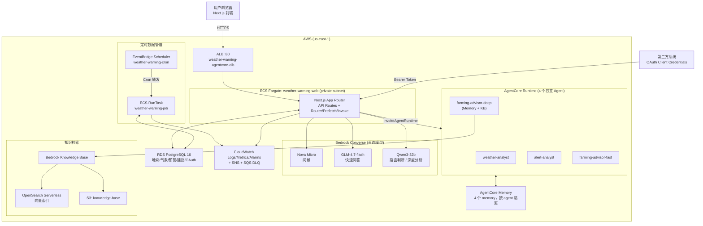
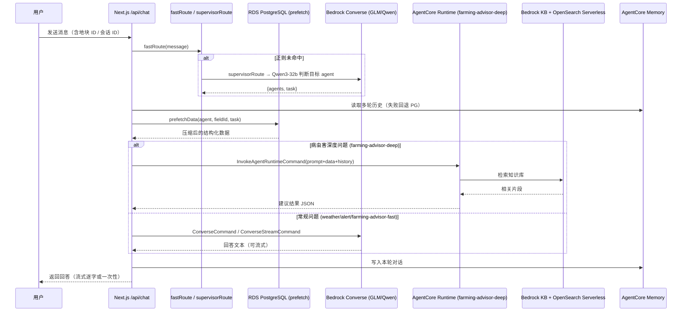

# 架构文档

## 目标

验证基于 AWS Bedrock AgentCore 的多 Agent 编排能力，面向新疆马铃薯种植场景，构建一个能做气象数据分析、预警研判、农事建议生成、知识库检索（病虫害防治）并对外提供公开 API 的农业气象预警平台，串联起 Next.js Web 应用、4 个 AgentCore Runtime Agent、定时数据管道和 Bedrock Knowledge Base。

## 组件

- **Web**：Next.js 15 App Router，部署在 ECS Fargate（X86_64），服务名 `weather-warning-web`，前面挂 ALB
- **数据库**：RDS PostgreSQL 16（Drizzle ORM），承载地块、气象、预警、农事建议、OAuth 等业务表
- **Agent 编排**（应用内，`src/lib/services/router.ts` / `agentcore.ts` / `invoke.ts`）：
  - 快速正则路由 `fastRoute`（0 延迟）+ LLM 兜底路由 `supervisorRoute`（Qwen3-32b）
  - 数据预取层 `prefetch.ts`：查询 DB 并压缩进 Prompt
  - 本地 Converse 调用（Nova Micro 问候、GLM-4.7-flash 快速问答）
  - AgentCore Runtime 调用（`InvokeAgentRuntimeCommand`，深度农事建议路径）
- **AgentCore Runtime Agent**（`agents/` 目录，各自独立部署）：
  - `weather-analyst`：气象数据分析
  - `alert-analyst`：预警研判
  - `farming-advisor-fast`：快速农事建议
  - `farming-advisor-deep`：深度农事建议（带 Memory + Bedrock KB 检索，病虫害类问题触发）
- **AgentCore Memory**：4 个 memory，按 agent 隔离，读取失败时回退到 PostgreSQL 存储的 transcript
- **知识库**：Bedrock Knowledge Base + OpenSearch Serverless（向量检索），S3 存放知识库源文档（马铃薯种植指南、病虫害防治、气候资料）
- **定时数据管道**：EventBridge Scheduler（group `weather-warning-cron`）定时触发 ECS RunTask（task family `weather-warning-job`），执行天气抓取、预警检测、每日/周度建议生成、历史数据回填、物化视图刷新等脚本
- **对外 API**：`/api/v1/public/*`（OAuth 2.0 Client Credentials 鉴权）供第三方拉取天气预报、活跃预警、每日农事建议
- **观测**：CloudWatch Logs/Metrics/Alarms、SNS（cron 告警）、SQS DLQ（失败任务死信队列）
- **IaC**：AWS CDK v2（TypeScript），两个 CloudFormation Stack（Foundation Stack + App Stack）

## 架构图

Web 用户请求先经 ALB 转发到私有子网中的 ECS Fargate `weather-warning-web` 服务。应用内的路由层先用正则 `fastRoute` 做零延迟意图识别，命中失败时调用 Qwen3-32b 做 LLM 兜底路由，再由预取层从 RDS 查询相关数据压缩进 Prompt。简单场景直接走本地 Bedrock Converse 调用对应模型，病虫害类深度农事问题则改走 AgentCore Runtime 调用 `farming-advisor-deep`，检索 Bedrock Knowledge Base 后生成建议；多轮对话历史优先读写 AgentCore Memory，读取失败时回退到 PostgreSQL。

与此并行，EventBridge Scheduler 按 11 条 Cron 规则定时触发 ECS RunTask 执行天气抓取、预警检测、农事建议生成等任务，任务状态写入 `cron_run` 表，失败进入 SQS DLQ 并触发 SNS 告警。第三方系统可通过 OAuth 2.0 Client Credentials 换取 Bearer Token，调用 `/api/v1/public/*` 只读接口获取天气预报、预警和每日农事建议。

## 请求路径图

## 关键技术点

- **路由分级**：正则 `fastRoute` 覆盖高频意图（天气/预警/农事关键词），零延迟；未命中才调用 Qwen3-32b `supervisorRoute` 做一次轻量 JSON 判定，控制路由本身的延迟和成本。
- **Fast/Deep 双路径**：`farming-advisor` 默认走本地 Converse（GLM-4.7-flash）快速应答；仅当命中病虫害关键词（晚疫/早疫/蚜虫/防治/农药/杀菌）且开启 `USE_AGENTCORE_FARMING` 时，才切到 AgentCore Runtime 的 `farming-advisor-deep`，触发 Bedrock KB 检索，用更强的 Qwen3-32b 做深度分析——用关键词区分"要不要查知识库"，避免所有请求都走重路径。
- **Memory 与 PG 双写兜底**：多轮对话优先读写 AgentCore Memory（按 agent 隔离），读取异常时自动降级到 PostgreSQL 的 `agent_session/message` 表，保证对话历史不因 Memory 服务波动而丢失。
- **回复强化层**：`invoke.ts` 中的 `strengthenAgentReply` 对模型回答做规则校验，如天气类回答缺少温度/降水关键词、预警类回答缺少风险等级说明时自动补充固定话术，防止模型漏答关键字段。
- **定时任务与失败可观测**：EventBridge Scheduler + ECS RunTask 承载 11 类定时作业（数据抓取、预警检测、建议生成、历史回填、物化视图刷新等），执行状态统一写入 `cron_run` 表，失败任务进入 SQS DLQ 并通过 SNS 告警，避免静默失败。
- **公开 API 与内部 API 分离**：内部管理走 Cookie 会话鉴权，第三方集成走独立的 OAuth 2.0 Client Credentials（`oauth_client`/`oauth_token` 表 + `api_call_log` 审计），互不复用鉴权体系。

更多数据模型、部署细节与 Cron 计划见 [design.md](design.md)、[deployment.md](deployment.md)、[public-api-guide.md](public-api-guide.md)。
